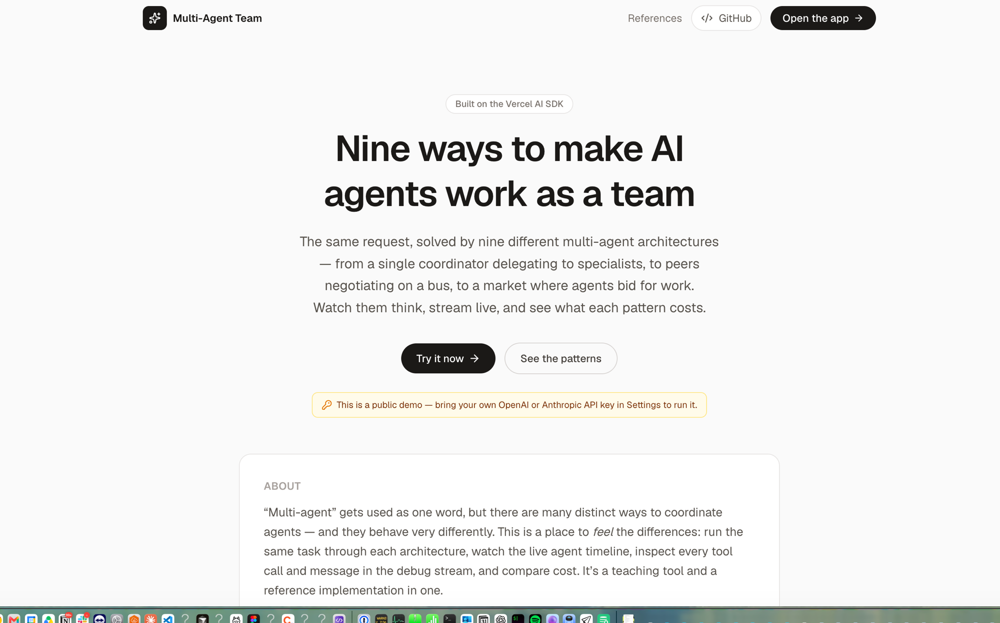
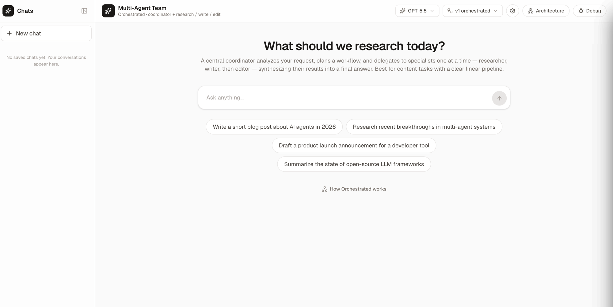
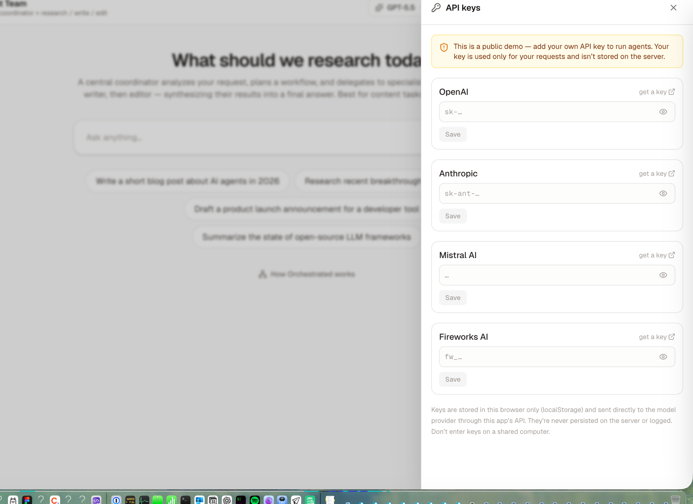
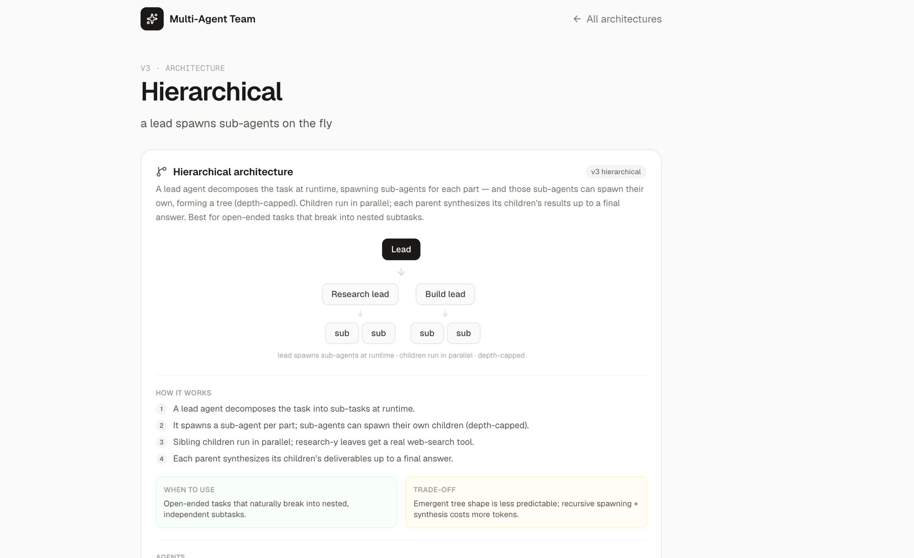

# Multi-Agent AI System

[](https://mat.umai-tech.com)
[](https://nextjs.org)
[](https://react.dev)
[](https://sdk.vercel.ai)
[](https://www.typescriptlang.org)
[](LICENSE)
[](https://github.com/MarcusElwin/multi-agents-team/stargazers)

[-blue)](#overview)
[](https://platform.openai.com)
[](https://www.anthropic.com)
[](https://mistral.ai)
[](https://fireworks.ai)

A multi-agent AI playground built with **Next.js 16** and the **Vercel AI SDK**.
It ships **nine multi-agent coordination patterns** (v1–v9) over a shared
event/message layer — each exposed as its own streaming API route and selectable
from the chat UI. Bring your own API key for **OpenAI, Anthropic, Mistral, or
Fireworks** and watch the agents reason, call tools, and converge live.

## Screenshots

| Landing | Chat |
| --- | --- |
|  |  |

| Settings — bring your own key | Architecture pages |
| --- | --- |
|  |  |

## Overview

The repo demonstrates nine complementary ways to coordinate LLM agents. Every
mode streams live (agent reasoning, tool calls, web searches), surfaces an
**estimated cost** per step and per run, and persists to a localStorage chat
history.

| Mode | Pattern | In one line | Best when | Trade-off |
| --- | --- | --- | --- | --- |
| **v1** | Orchestrated | Coordinator plans and delegates to research / write / edit specialists, then synthesizes. | Linear content pipelines with clear steps. | The coordinator is a bottleneck; no parallelism. |
| **v2** | Choreographed | Backend / frontend / design peers message each other via a bus until all complete. | Cross-functional tasks where peers negotiate a shared artifact. | Negotiation can loop; convergence isn't guaranteed. |
| **v3** | Hierarchical | A lead spawns sub-agents at runtime (depth-capped), which run in parallel and roll results up. | Open-ended tasks that break into nested subtasks. | Emergent tree shape is less predictable; costs more tokens. |
| **v4** | Evaluator–Optimizer | Generate → critique → revise until a quality bar is met. | Iteratively improving a single artifact to a bar. | Cost grows per round; a strict critic can burn the budget. |
| **v5** | Debate | Opposing sides argue; a judge decides and synthesizes. | Decisions where the strongest case for each side matters. | Adds argument rounds; verdict quality depends on the judge. |
| **v6** | Blackboard | Agents share one workspace; a controller picks who acts next. | Answers that assemble from many partial contributions. | Controller selection can loop; coordination is slower. |
| **v7** | Market | Agents bid on posted tasks; the best bid wins. | Heterogeneous work where the best agent isn't obvious. | The bid round is extra LLM calls; worth it for larger pools. |
| **v8** | Self-Consistency | Sample N attempts in parallel; a judge picks/merges the best. | Questions where agreement across attempts signals quality. | N samples cost N× tokens for the sampling step. |
| **v9** | Swarm | Identical agents build on a shared scratchpad over rounds. | Open-ended ideation that benefits from many cheap passes. | No structure → redundancy/drift; round-capped. |

Each pattern has a dedicated detail page at `/architectures/[mode]` with a
diagram, the trade-offs, and source references. See also the deep dive in
[`docs/ARCHITECTURE.md`](docs/ARCHITECTURE.md).

## Pages

| Route | What it is |
| --- | --- |
| `/` | Landing page — hero + cards for all nine architectures (server component). |
| `/chat` | The full chat app — mode + model selector, live timeline/tree, history. |
| `/architectures/[mode]` | Per-pattern detail page (diagram, trade-offs, references). |
| `/references` | A reading list of the papers/posts behind each pattern. |

## Providers & bring-your-own-key

The app proxies every model call through its own `/api/*` routes — the browser
never talks to a provider directly. You can supply your **own** key per provider
in **Settings**; it's stored in your browser (`localStorage`) and sent per
request, **never persisted on the server or logged**.

| Provider | Example models | Env var | Web search |
| --- | --- | --- | --- |
| **OpenAI** | `gpt-5.5` (default), `gpt-5.4`, `gpt-5.4-mini`, `o4-mini` | `OPENAI_API_KEY` | ✅ (hosted) |
| **Anthropic** | `claude-opus-4-8`, `claude-sonnet-4-6`, `claude-haiku-4-5` | `ANTHROPIC_API_KEY` | — |
| **Mistral AI** | `mistral-large-latest`, `mistral-medium-latest`, `magistral-medium-latest`, `mistral-small-latest` | `MISTRAL_API_KEY` | — |
| **Fireworks AI** | `deepseek-v3p1`, `llama-v3p3-70b-instruct`, `qwen3-235b` | `FIREWORKS_API_KEY` | — |

The v1 researcher uses OpenAI's hosted web search. On non-OpenAI providers it
**degrades gracefully** — the agent proceeds on general knowledge rather than
crashing the run (`webSearchAvailable()` in `lib/provider.ts`).

### Public deploy (`PUBLIC_BYO_KEY_ONLY`)

Set `PUBLIC_BYO_KEY_ONLY=true` (and `NEXT_PUBLIC_BYO_KEY_ONLY=true` for the UI
banner) and the server **ignores its own env keys** — every visitor must bring
their own. This is how the app is hosted publicly without the owner's key being
spent. Unset locally, the env key works as usual.

## Architecture (all nine illustrated)

### v1 — Orchestrated (`lib/agents/` + `lib/orchestrator.ts`)

```
                        ┌──────────────┐
            user ─────▶ │ /api/agents  │  (SSE stream)
                        └──────┬───────┘
                               ▼
                  ┌────────────────────────┐
                  │  AgentOrchestrator     │ ◀── reads bus, builds prompts
                  │  - LLM-driven routing  │     per-run agents w/ event hooks
                  │  - max 15 iterations   │
                  └───────────┬────────────┘
                              ▼
                       ┌────────────┐
                       │coordinator │ ◀──── always starts here
                       └─────┬──────┘
              ┌──────────────┼──────────────┐
              ▼              ▼              ▼
         ┌──────────┐  ┌────────┐    ┌────────┐
         │researcher│  │ writer │    │ editor │
         └──────────┘  └────────┘    └────────┘
```

### v2 — Choreographed (`lib/agents-v2/` + `lib/runner.ts`)

```
                       ┌──────────────────┐
            user ─────▶│ /api/agents-v2   │  (SSE stream)
                       └────────┬─────────┘
                                ▼
                  ┌─────────────────────────┐
                  │      AgentRunner        │
                  │  - round-robin schedule │
                  │  - inbox-fed prompts    │
                  │  - all-must-complete    │
                  └───────────┬─────────────┘
              ┌───────────────┼───────────────┐
              ▼               ▼               ▼
        ┌─────────┐     ┌─────────┐     ┌─────────┐
        │ backend │ ◀──▶│frontend │ ◀──▶│ design  │
        └─────────┘     └─────────┘     └─────────┘
              └── pub/sub via per-conversation bus ──┘
```

### v3 — Hierarchical (`lib/agents-v3/` + `lib/hierarchical-runner.ts`)

```
                       ┌──────────────────┐
            user ─────▶│ /api/agents-v3   │  (SSE stream)
                       └────────┬─────────┘
                                ▼
                       ┌──────────────┐
                       │     Lead     │  spawnSubAgent() at runtime
                       └──────┬───────┘
                ┌─────────────┴─────────────┐
                ▼                           ▼
         ┌─────────────┐            ┌─────────────┐
         │ sub-agent A │            │ sub-agent B │  (run in parallel)
         └──────┬──────┘            └──────┬──────┘
            ┌───┴───┐                  ┌───┴───┐
            ▼       ▼                  ▼       ▼
          leaf    leaf               leaf    leaf      (depth-capped)
```

Caps: depth **2**, width **4** per node, **15** total nodes. Each parent runs a
synthesis pass over its children's deliverables.

### v4 — Evaluator–Optimizer (`lib/evaluator-optimizer-runner.ts`)

```
                       ┌──────────────────┐
            user ─────▶│ /api/agents-v4   │  (SSE stream)
                       └────────┬─────────┘
                                ▼
                     ┌────────────────────┐
                     │     Generator      │ ◀───────────┐
                     │   writes a draft   │             │ revise with
                     └─────────┬──────────┘             │ the critic's
                               ▼                        │ issues
                     ┌────────────────────┐             │
                     │      Critic        │ ── issues ──┘
                     │  scores 0–10       │
                     └─────────┬──────────┘
                               ▼
                   score ≥ 8  ?  ──▶ done   (else loop, up to 4 rounds)
```

Pass bar: score **≥ 8**, max **4** rounds (keeps the best draft if never passed).

### v5 — Debate (`lib/debate-runner.ts`)

```
                       ┌──────────────────┐
            user ─────▶│ /api/agents-v5   │  (SSE stream)
                       └────────┬─────────┘
                                ▼
              ┌─────────────┐       ┌─────────────┐
              │ Affirmative │ ◀──▶  │  Opposing   │   3 rounds of argument
              └──────┬──────┘       └──────┬──────┘
                     └───────────┬─────────┘
                                 ▼
                          ┌─────────────┐
                          │    Judge    │  picks a winner + synthesizes
                          └─────────────┘
```

Two debaters argue opposing stances for **3** rounds; a judge rules and synthesizes.

### v6 — Blackboard (`lib/blackboard-runner.ts`)

```
                       ┌──────────────────┐
            user ─────▶│ /api/agents-v6   │  (SSE stream)
                       └────────┬─────────┘
                                ▼
                   ┌──────────────────────────┐
                   │   Controller (each round)│  picks who acts next
                   └────────────┬─────────────┘
              ┌─────────────────┼─────────────────┐
              ▼                 ▼                 ▼
        ┌──────────┐      ┌──────────┐      ┌──────────┐
        │ analyst  │      │ planner  │      │  critic  │
        └────┬─────┘      └────┬─────┘      └────┬─────┘
             └─────────────────┼─────────────────┘
                               ▼
                  ┌──────────────────────────┐
                  │   shared blackboard       │  named sections, read/write
                  └──────────────────────────┘
```

A content-driven controller picks one role per round; agents read/write named
sections of a shared board until a `solution` settles, or **8** rounds.

### v7 — Market (`lib/market-runner.ts`)

```
                       ┌──────────────────┐
            user ─────▶│ /api/agents-v7   │  (SSE stream)
                       └────────┬─────────┘
                                ▼
                     ┌────────────────────┐
                     │  post tasks to the │
                     │   auction board    │
                     └─────────┬──────────┘
                               ▼  agents bid (fit 0–1, est. $)
        ┌────────────┬─────────────┬────────────┐
        ▼            ▼             ▼            ▼
   ┌─────────┐ ┌──────────┐ ┌──────────┐ ┌─────────┐
   │researcher│ │ engineer │ │ designer │ │ analyst │
   └─────────┘ └──────────┘ └──────────┘ └─────────┘
        └────────────┴──────┬──────┴────────────┘
                            ▼
              award each task to its best bid  (≤ 2 tasks per agent)
```

Tasks are auctioned to a roster of four; the highest-fit bid wins each, greedily,
with a per-agent bundle cap of **2**.

### v8 — Self-Consistency (`lib/self-consistency-runner.ts`)

```
                       ┌──────────────────┐
            user ─────▶│ /api/agents-v8   │  (SSE stream)
                       └────────┬─────────┘
                                ▼  same prompt, N parallel samples
        ┌────────────┬─────────────┬────────────┐
        ▼            ▼             ▼            ▼
   ┌─────────┐  ┌─────────┐   ┌─────────┐  ┌─────────┐
   │sample 1 │  │sample 2 │   │sample 3 │  │sample 4 │   (run in parallel)
   └────┬────┘  └────┬────┘   └────┬────┘  └────┬────┘
        └────────────┴──────┬──────┴────────────┘
                            ▼
                    ┌───────────────┐
                    │     Judge     │  selects or merges the best
                    └───────────────┘
```

Draws **4** independent samples in parallel; a judge selects the best or merges
them into a consensus.

### v9 — Swarm (`lib/swarm-runner.ts`)

```
                       ┌──────────────────┐
            user ─────▶│ /api/agents-v9   │  (SSE stream)
                       └────────┬─────────┘
                                ▼  N identical agents act every round
        ┌────────────┬─────────────┬────────────┐
        ▼            ▼             ▼            ▼
   ┌────────┐   ┌────────┐    ┌────────┐   ┌────────┐
   │ agent  │   │ agent  │    │ agent  │   │ agent  │   (no roles, no controller)
   └───┬────┘   └───┬────┘    └───┬────┘   └───┬────┘
       └────────────┴──────┬──────┴────────────┘
                           ▼
              ┌──────────────────────────┐
              │   shared scratchpad        │  each leaves a trace; next round
              └──────────────────────────┘  builds on it  (3 rounds)
```

**4** identical agents build on a shared scratchpad over **3** rounds — pure
stigmergy: no roles, no controller, no direct messaging.

For the full comparison and trade-offs see [`docs/ARCHITECTURE.md`](docs/ARCHITECTURE.md)
and each `/architectures/[mode]` page.

## Features

- **Nine coordination patterns** — switchable from the chat UI, each with its own
  live visualization (timeline, tree, build-plan board, score ladder, debate,
  blackboard, auction, sample fan-out, swarm scratchpad).
- **Four providers, BYO key** — OpenAI / Anthropic / Mistral / Fireworks, entered
  in Settings, stored client-side, never persisted server-side.
- **Live streaming** — agent reasoning (`onStepFinish`), tool calls, and web
  searches stream as they happen.
- **Cost estimates** — per-step and per-run token cost (indicative pricing in
  `lib/models.ts`), in the timeline, message meta, and terminal logs.
- **Structured report deliverable** — modes can return a `ReportView` (KPIs,
  charts via recharts, tables) rendered inline in chat.
- **Chat history** — conversations persist in localStorage; runs continue in the
  background when you switch chats and write back to their originating chat.
- **Code preview sidecar** — detects code/JSON; a slide-over with syntax
  highlighting, copy, and a sandboxed live HTML/React preview.
- **Debug stream** — a drawer of every event with pretty-printed JSON.
- **Human-in-the-loop** — v1 can pause and ask the user a question mid-run.
- **Per-conversation message bus** — no cross-request state leakage.
- **Hardened** — input validation + CSP/security headers; see [`SECURITY.md`](SECURITY.md).

## Tech Stack

- **Framework**: Next.js 16 (App Router, Turbopack)
- **Runtime**: React 19
- **AI SDK**: Vercel AI SDK 5 (Experimental Agent API)
- **Providers**: `@ai-sdk/openai`, `@ai-sdk/anthropic`, `@ai-sdk/mistral`, `@ai-sdk/fireworks`
- **Charts**: recharts · **Validation**: Zod · **Styling**: Tailwind CSS 4
- **UI**: lucide-react icons, custom markdown renderer, `chalk` + `boxen` logs
- **Language**: TypeScript · **Package Manager**: pnpm

## Getting Started

### Prerequisites

- Node.js **20.9+** (Next 16 requires it)
- **pnpm** (this repo uses pnpm — `npm install` is not supported)
- At least one provider API key (OpenAI, Anthropic, Mistral, or Fireworks)

### Installation

```bash
git clone https://github.com/MarcusElwin/multi-agents-team.git
cd multi-agents-team
pnpm install
cp .env.example .env.local
```

Then edit `.env.local` and add at least one key:

```bash
OPENAI_API_KEY=sk-...
# ANTHROPIC_API_KEY=sk-ant-...
# MISTRAL_API_KEY=...
# FIREWORKS_API_KEY=fw_...
# PUBLIC_BYO_KEY_ONLY=true      # public deploy: ignore env keys, require BYO
# NEXT_PUBLIC_BYO_KEY_ONLY=true # show the BYO banner in the UI
```

You can also skip `.env.local` entirely and enter keys in the in-app **Settings**
drawer.

### Running

```bash
pnpm dev            # dev server → http://localhost:3000
pnpm build && pnpm start   # production build
```

### CLI tests

```bash
pnpm test:agents    # v1 — orchestrated (coordinator + researcher + writer + editor)
pnpm test:runner    # v2 — choreographed (backend + frontend + design)
pnpm test:smoke     # run a tiny prompt through every mode (v1–v9); SMOKE_MODEL to override
```

## Chat UI

A built-in chat app at `/chat` (the landing page lives at `/`).

### Header controls

- **Model selector** — models grouped by provider from `lib/models.ts`. The
  selected model applies to every agent in the run.
- **Mode selector** — pick any of v1–v9, routing to `/api/agents` … `/api/agents-v9`.
- **Backend selector** — run a turn on the **in-app harness** (default) or the
  **iii engine** (`lib/backends.ts`). Per-run here; the global default lives in
  Settings. See [Backends](#backends-in-app-harness--iii-engine).
- **Settings** — enter/clear per-provider API keys (stored in your browser), and
  set the default execution backend.
- **Architecture / Debug** — the per-mode diagram drawer and the live event stream.

### Conversation

- **Welcome state**: mode-aware suggestion chips + a collapsible architecture panel.
- **While running**: each mode renders its own live view (timeline, tree, board,
  ladder, debate, blackboard, auction, sample fan-out, or swarm) with a running
  cost readout.
- **Completed messages**: a synthesized markdown report (long reports collapse;
  code renders as blocks with a "View code" preview), a pattern-specific summary
  card, and an optional structured `ReportView` (KPIs/charts/tables).
- **Meta pills**: mode, model, iterations/agents, duration, estimated cost.
- **Sidebar**: past conversations (localStorage), grouped by recency, running dot
  for in-flight runs.

> **⚠️ Model access:** picking a model id your account isn't enabled for returns
> a 4xx in the chat. Unknown values fall back to the default.

## API Routes

All nine architectures are **Server-Sent Events** endpoints
(`Content-Type: text/event-stream`). Each `data:` frame is a JSON `AgentEvent`
(see `lib/agent-events.ts`); a run ends with `workflow_complete` (or
`workflow_error`). Request body: `{ message, model?, history?, apiKey?, provider? }`.
The body is validated and bounded (`lib/validate-request.ts`) — see
[`SECURITY.md`](SECURITY.md).

```bash
curl -N -X POST http://localhost:3000/api/agents \
  -H "Content-Type: application/json" \
  -d '{"message": "Write a blog post about AI agents", "model": "gpt-5.5"}'
```

| Route | Mode | `maxDuration` |
| --- | --- | --- |
| `/api/agents` | v1 orchestrated | 60s |
| `/api/agents-v2` | v2 choreographed | 120s |
| `/api/agents-v3` | v3 hierarchical | 300s |
| `/api/agents-v4` | v4 evaluator–optimizer | 180s |
| `/api/agents-v5` | v5 debate | 180s |
| `/api/agents-v6` | v6 blackboard | 240s |
| `/api/agents-v7` | v7 market | 240s |
| `/api/agents-v8` | v8 self-consistency | 180s |
| `/api/agents-v9` | v9 swarm | 240s |
| `/api/agents/input` | human-in-the-loop answer delivery | — |

Each run route also has a `GET` returning a small readiness/status object.

## Configuration

### Backends: in-app harness ↔ iii engine

Every run targets an **execution backend**, chosen per-run in the chat control
row and defaulted globally in Settings (persisted in `localStorage`, threaded
through the request body and validated in `lib/validate-request.ts`):

| Backend | What runs the turn | Needs |
| --- | --- | --- |
| **In-app harness** (`current`, default) | The orchestrator/runners in `lib/` over the Vercel AI SDK, in-process. | Nothing — works out of the box. |
| **iii engine** (`iii`) | The [iii](https://github.com/iii-hq/iii) engine: a separate process exposing a WebSocket bus of swappable workers (turn FSM, provider streaming, policy, budget, sessions, tracing). | A reachable engine; see env below. |

When a run uses the `iii` backend, the route calls `runIiiBackend`
(`lib/iii/run-iii.ts`), which **POSTs the turn to the engine over HTTPS** and
replays the returned events into this app's `AgentEvent` stream — so the existing
chat UI renders it unchanged. On the engine side, our worker (`iii-worker/`)
registers a `mat::run` function (which drives the **same `lib/` runners** as the
in-app path) plus a `POST /run` HTTP trigger. If the engine isn't configured or
reachable, the run fails closed with a clear message and the in-app harness is
unaffected.

```bash
# App side (set where the Next app runs, e.g. Vercel) — only the `iii` backend uses these
III_ENGINE_HTTP_URL=https://mat-iii-engine.fly.dev  # engine HTTP endpoint
III_ENGINE_TOKEN=<shared-secret>                    # authorizes a run (Bearer)
III_RUN_PATH=/run                                   # worker's trigger path
III_TURN_TIMEOUT_MS=240000                          # per-turn timeout
NEXT_PUBLIC_III_BACKEND_ENABLED=true                # drop the "preview" hint in the UI
```

This is the first step of the [iii migration](https://github.com/MarcusElwin/multi-agents-team/issues/10):
the toggle, the worker, and the integration seam land now; adopting iii's native
policy/budget/session workers per pattern is the follow-up.

### Deploy the iii engine (Fly.io)

The engine is a long-running process, so it lives **off** Vercel. This repo ships
a `Dockerfile` (engine `iiidev/iii` + the `iii-worker/`), `fly.toml`, and
`docker-entrypoint.sh` to run both in one machine — the worker connects to the
engine on `ws://localhost:49134` and the engine serves HTTP on `:3111`.

```bash
# 1. Create the Fly app (keeps the bundled fly.toml)
fly launch --no-deploy

# 2. Set a shared secret (and optionally server-side provider keys for non-BYO)
fly secrets set III_ENGINE_TOKEN=$(openssl rand -hex 32)
# fly secrets set OPENAI_API_KEY=...   # optional: engine's own keys

# 3. Deploy
fly deploy

# 4. Point the Next app at it (Vercel env), using the SAME token:
#    III_ENGINE_HTTP_URL=https://<app>.fly.dev
#    III_ENGINE_TOKEN=<same secret>
#    NEXT_PUBLIC_III_BACKEND_ENABLED=true
```

Locally you can run the engine (`iii --use-default-config`) and the worker
(`pnpm worker`) in two terminals, with `III_ENGINE_HTTP_URL=http://localhost:3111`.
BYO keys take one extra hop to the engine on this path — see `SECURITY.md` §2.

### Adopting iii's prebuilt workers

The worker keeps our `lib/` runners but can lean on iii's [registry
workers](https://workers.iii.dev/) for the cross-cutting harness jobs. Each is
**off by default** (the batch HTTP path stays the verified default) and turns on
with one env flag — set the same flag on the worker (Fly secret) and, where
noted, on the app (Vercel):

| Capability | Worker | What it does | Flag |
| --- | --- | --- | --- |
| **iii-stream** | `iii-worker/stream.ts` + app `lib/iii/stream-read.ts` | Publishes run events live; the app reads them from the engine Stream API instead of a batched result — restores the live timeline. | `III_STREAM_ENABLED` (app+worker) |
| **iii-state** | `iii-worker/state.ts` | Server-side session history keyed by `conversationId`, replacing localStorage-only history. | `III_STATE_ENABLED` (worker) |
| **iii-queue** | `iii-worker/index.ts` | Enqueues the turn so it outlives the HTTP request (durable long runs; fixes the [HITL timeout](https://github.com/MarcusElwin/multi-agents-team/issues/22)). | `III_QUEUE_ENABLED` (worker) |
| **harness policy** | `iii-worker/policy.ts` + `lib/iii/policy-context.ts` + `iii-permissions.yaml` | Gates tools (today `web_search`) through `policy::check_permissions` before they run — fail-closed. | `III_POLICY_ENABLED` (worker) |

The policy gate uses an `AsyncLocalStorage` context (`lib/iii/policy-context.ts`),
so shared tools stay provider-agnostic — it's a no-op on the in-app backend.

> **Verify against a live engine.** The engine-specific function ids, the Stream
> API read path, and the policy/state payload shapes are all env-configurable and
> marked `VERIFY (live engine)` in the worker source — confirm them on your first
> deploy and adjust the env (no code change needed). See the full env list in
> [`.env.example`](.env.example).

### Models, providers & cost — `lib/models.ts`

```typescript
export type ProviderId = 'openai' | 'anthropic' | 'mistral' | 'fireworks';
export const DEFAULT_MODEL: ModelId = 'gpt-5.5';
export const MODEL_OPTIONS: ModelOption[];      // { value, label, provider, description }
export const PROVIDERS: Record<ProviderId, { envVar; keyPrefix; createClient(apiKey) }>;
export function providerForModel(model): ProviderId;
export function resolveModel(input?): ModelId;   // safe, with fallback
export function estimateCost(model, usage): number; // USD
```

Per-request credentials are resolved and isolated via `AsyncLocalStorage`
(`lib/provider.ts`): `withProvider({ providerId, apiKey }, fn)` wraps a run, and
agents call `provider()` instead of importing a provider directly — so adding a
provider is one entry in `PROVIDERS`, not a signature change across 16 files.

### Caps & timeouts

| | v1 | v2 | v3 |
| --- | --- | --- | --- |
| Iteration / node cap | `maxIterations = 15` | `maxIterations = 10` | depth 2 · width 4 · 15 nodes |
| API `maxDuration` | 60s | 120s | 300s |

v4–v9 are round/sample-capped; see each runner in `lib/` and the route
`maxDuration` table above.

## Project Structure

```
multi-agents-team/
├── app/
│   ├── api/agents{,-v2..-v9}/route.ts   # nine SSE endpoints
│   ├── api/agents/input/route.ts        # human-in-the-loop answer delivery
│   ├── architectures/[mode]/page.tsx    # per-pattern detail page
│   ├── chat/page.tsx                    # the full chat app
│   ├── references/page.tsx              # reading list
│   ├── components/                      # timeline, tree, drawers, ReportView, …
│   ├── hooks/                           # useConversations, useSettings
│   └── page.tsx                         # landing page
├── lib/
│   ├── agents{,-v2,-v3..}/              # per-mode agent factories
│   ├── tools/                           # web-search, report, …
│   ├── *-runner.ts / orchestrator.ts    # one runner per mode
│   ├── models.ts                        # catalog, PROVIDERS, pricing, cost
│   ├── provider.ts                      # AsyncLocalStorage provider injection
│   ├── modes.ts                         # v1–v9 mode specs (+ references)
│   ├── validate-request.ts              # request-body validation/bounds
│   ├── conversation.ts / message-bus.ts # per-run state
│   └── agent-events.ts                  # AgentEvent union + RunSummary
├── scripts/                             # test-agents, test-runner, smoke-test
├── docs/                                # ARCHITECTURE.md, images/
├── SECURITY.md
└── README.md
```

## Extending the system

### Add a provider

One entry in `PROVIDERS` (`lib/models.ts`) with its `createClient`, plus its
models in `MODEL_OPTIONS` and rates in `MODEL_PRICING`. The settings drawer and
model selector are data-driven, so the new provider appears automatically.

### Add a mode

1. Agents in `lib/agents-vN/` (factories taking `(model, hooks)`).
2. A runner in `lib/` that drives the loop and emits `AgentEvent`s.
3. An SSE route at `app/api/agents-vN/route.ts`.
4. New event variants in `lib/agent-events.ts` (widen the `mode` unions).
5. A `MODES.vN` spec in `lib/modes.ts` (label, diagram, suggestions, references).
6. UI wiring in `app/chat/page.tsx` (+ a render component if the output is new).

## Security

Input validation, BYO-key handling, CSP/security headers, and the threat model
are documented in [`SECURITY.md`](SECURITY.md). Found a vulnerability? Email
**marcus@elwin.com** — please don't open a public issue.

## Troubleshooting

- **"API key required"** — add a key in Settings, or set the provider's env var
  in `.env.local`; restart the dev server after editing env vars.
- **4xx on a request** — the chosen model isn't enabled on your account; pick another.
- **Node version error** — Next 16 needs Node ≥ 20.9 (`nvm use 20`).
- **`npm install` errors** — use **pnpm**, not npm.
- **Cost shows $0** — the AI SDK didn't return token `usage` for that call;
  estimates depend on it and are indicative, not billing-accurate.

## Deploy on Vercel

```bash
pnpm i -g vercel
vercel link        # link to a Vercel project
vercel             # deploy a preview; `vercel --prod` for production
```

Then in the Vercel dashboard → **Settings → Environment Variables**, add the
provider keys you want as server fallbacks, and (for a public deploy)
`PUBLIC_BYO_KEY_ONLY=true` + `NEXT_PUBLIC_BYO_KEY_ONLY=true`.

## License

MIT License

## Acknowledgments

- Built with the [Vercel AI SDK](https://sdk.vercel.ai/)
- Patterns informed by Anthropic's [Building effective agents](https://www.anthropic.com/research/building-effective-agents)
  and the sources on each `/architectures/[mode]` page.

---

**Note**: This project uses the Vercel AI SDK's experimental Agent API. Features
may change as the SDK evolves.
